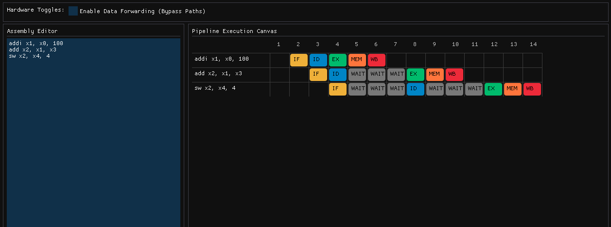

# RISC-V 5-Stage Pipeline Visualizer

**Interactive real-time tool that visualizes a 5-stage RISC-V pipeline (IF-ID-EX-MEM-WB) with assembly editor and "what-if" toggles.**



## The Problem

Understanding pipeline hazards, stalls, and data forwarding in a 5-stage processor is hard from static diagrams or textbooks. Students and engineers need an interactive way to type real RISC-V assembly and instantly see how forwarding, stalls, and clock cycles behave.

## The Solution

This tool lets you:

- Type or paste RV32I assembly in a live editor (left panel)
- Toggle data forwarding ON/OFF in real time
- Watch a dynamic Gantt-chart visualization (right panel) showing every instruction moving through IF → ID → EX → MEM → WB
- See stalls as grey bubbles and forwarding paths as curved arrows

The simulator re-runs instantly on every keystroke and redraws the chart with exact cycle-by-cycle state.

**Implemented Features**

- Simple but strict RV32I parser (add, sub, lw, sw, beq, etc.)
- Full 5-stage simulation engine with hazard detection and stall/bubble insertion
- Clean, dark-mode ImGui split-screen layout (left editor + right canvas)
- The simulator is wired directly to the text buffer, re-parsing and re-simulating the CPU at 60 FPS as you type without needing a "Run" button
- Dynamic Gantt-chart generated using `ImDrawList` graphics

**Planned Features**

- Data forwarding logic + visual curved arrows
- WebAssembly build + GitHub Pages deployment

## Techniques & Tools

- **Core**: C++17 + Dear ImGui (GLFW + OpenGL3 backend)
- **Build**: CMake with Git submodules (`vendor/`)
- **Visualization**: ImGui::GetWindowDrawList() for Gantt chart + Bezier arrows
- **Simulation**: Cycle-accurate 5-stage pipeline with hazard detection and forwarding logic
- **Target**: RV32I subset (easy to extend)

## How to Build & Run (macOS/Linux)

Ensure you have a C++17 compiler and CMake (3.10+) installed.

```bash
# Clone the repository and its submodules (ImGui & GLFW)
git clone --recursive [https://github.com/hrayyy14/riscv-pipeline-visualizer.git](https://github.com/hrayyy14/riscv-pipeline-visualizer.git)
cd riscv-pipeline-visualizer

# Generate build files and compile
cmake -B build
cmake --build build

# Run the visualizer
./build/Visualizer
```
